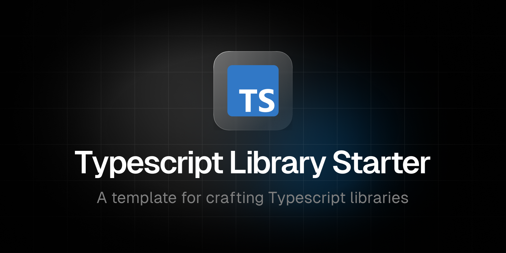

 

  <b>A template for crafting Typescript libraries</b>

## Introduction

`typescript-library-starter` serves as a foundational scaffold for developers, offering an intuitive and organized starting point for creating scalable and maintainable TypeScript projects.

### Includes

- [pnpm](https://github.com/pnpm/pnpm): Fast, disk space efficient package manager.
- [typescript](https://github.com/microsoft/TypeScript): Superset of JavaScript that compiles to clean JavaScript output.
- [nextra](https://nextra.site/): Simple, powerful and flexible site generation framework.
- [tsup](https://github.com/egoist/tsup): The simplest and fastest way to bundle your TypeScript libraries.
- [eslint](https://github.com/eslint/eslint): Find and fix problems in your JavaScript code.
- [prettier](https://github.com/prettier/prettier): Opinionated code formatter.
- [lint-staged](https://github.com/lint-staged/lint-staged): Run linters on git staged files.
- [husky](https://github.com/typicode/husky): Git hooks made easy.
- [github-actions](https://github.com/features/actions): Workflow automations.

## Configuration

The default configuration is the one that I usually find more suitable for my projects. Adapt it to fit your requirements.

- Configure [package.json](package.json)
- Configure [README](README.md)
- Configure [typescript options](tsconfig.json)
- Configure [tsup options](tsup.config.ts)
- Configure [eslint options](.eslintrc)
- Configure [prettier options](prettier.config.js)
- Configure [changeset options](.changeset/config.json)
- Configure [lint-staged options](lint-staged.config.js)
- Configure [husky "pre-commit"](.husky/pre-commit) (or add yours)

### Repository Secrets

- COVERALLS_REPO_TOKEN
- NPM_TOKEN
- Settings > Actions > General > Workflow permissions > Allow GitHub Actions to create and approve pull requests

## Authors

- Hugo Corta ([@hugocxl](https://github.com/hugocxl))

## License

MIT License © 2023-Present [Hugo Corta](https://github.com/hugocxl)
